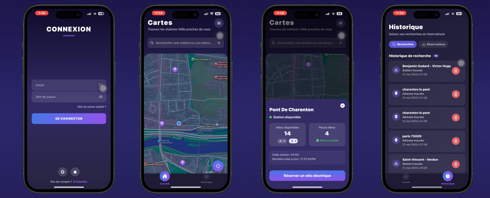

# 🚲 MobileApp Vélib - Application de Géolocalisation des Stations

## 📱 À propos du projet

MobileApp Vélib est une application mobile développée avec React Native qui permet aux utilisateurs de localiser et d'obtenir des informations sur les stations Vélib (vélos en libre-service) à Paris. L'application affiche une carte interactive avec toutes les stations disponibles, fournit des détails sur chaque station et permet aux utilisateurs de trouver les stations les plus proches grâce à la géolocalisation.



> **Architecture du système** : Ce projet est le frontend mobile qui se connecte à un backend Docker (projet principal) disponible dans un dépôt séparé. Pour une expérience complète, vous devez également configurer le backend Docker_Velib.

## ✨ Fonctionnalités

- 🗺️ **Carte interactive** affichant toutes les stations Vélib
- 📍 **Géolocalisation** pour trouver les stations à proximité
- 🔄 **Rechargement des données** par double-clic sur l'onglet Accueil
- 🔍 **Recherche de stations** par nom / adresse
- 🔒 **Authentification** des utilisateurs
- 📱 **Interface utilisateur moderne** avec gradients et animations

## 🛠️ Technologies utilisées

- 📱 &nbsp;**Mobile**
  
  
  

- 🔄 &nbsp;**State Management**
  
  
  

- 🗺️ &nbsp;**Cartographie**
  
  

- 🌐 &nbsp;**API & Réseau**
  
  

- 🎨 &nbsp;**UI & UX**
  
  
  

- 🖥️ &nbsp;**Backend**
  
  
  
  

- 🔧 &nbsp;**Outils de développement**
  
  

## 📂 Structure du projet

```
MobileApp_Velib/
├── src/                    # Dossier principal de l'application
│   ├── App.js              # Point d'entrée de l'application
│   ├── components/         # Composants réutilisables
│   ├── navigation/         # Configuration de la navigation
│   ├── screens/            # Écrans de l'application
│   │   ├── Auth/           # Écrans d'authentification
│   │   └── Tab/            # Écrans des onglets principaux
│   ├── services/           # Services pour les appels API
│   ├── store/              # Configuration Redux
│   └── utils/              # Utilitaires (localisation, etc.)
├── backend/                # Backend Flask
│   ├── server.py           # Point d'entrée du serveur
│   └── app/                # Application Flask
└── assets/                 # Images et ressources
```

## 🚀 Installation et déploiement

### Prérequis

- [Node.js](https://nodejs.org/) (v16 ou supérieur)
- [npm](https://www.npmjs.com/) ou [yarn](https://yarnpkg.com/)
- [Expo CLI](https://docs.expo.dev/get-started/installation/)
- [Python](https://www.python.org/) (v3.10 ou supérieur) pour le backend
- [Docker](https://www.docker.com/) et [Docker Compose](https://docs.docker.com/compose/)

### Installation de l'application mobile

1. **Cloner le dépôt**

   ```bash
   git clone https://github.com/aariisto/Velib_MobileApp
   cd MobileApp_Velib
   ```

2. **Installer les dépendances**

   ```bash
   npm install
   # ou
   yarn install
   ```

3. **Configurer l'API**
   Modifiez `src/services/api.config.js` pour définir votre adresse IP .

4. **Lancer l'application**

   ```bash
   npm start
   # ou
   yarn start
   ```

5. **Scanner le QR code** avec l'application Expo Go sur votre appareil mobile ou lancer sur un émulateur.

> **Important** : Le téléphone et le PC sur lequel le projet est exécuté doivent être connectés au même réseau Wi-Fi.
> 
### Déploiement du backend

1. **Cloner le repository backend (projet principal)**

   ```bash
   git clone https://github.com/aariisto/Docker_Velib_Mobile
   ```

2. **Accéder au dossier du projet backend**

   ```bash
   cd Docker_Velib
   ```

3. **Démarrer avec Docker Compose**
   ```bash
   docker-compose up -d
   ```

> **Important** : Le téléphone et le PC sur lequel le projet est exécuté doivent être connectés au même réseau Wi-Fi.

## 🔄 Fonctionnalités spéciales

### Double-clic sur l'onglet Accueil

L'application implémente une fonctionnalité de rechargement des données par double-clic sur l'onglet "Accueil". Cette fonctionnalité utilise `EventRegister` pour communiquer entre les composants et recharger les stations sans avoir à naviguer ailleurs.

### Géolocalisation et rafraîchissement de la carte

Le composant `HomeScreen` utilise les utilitaires de localisation pour obtenir la position de l'utilisateur et centrer la carte sur cette position. Les stations Vélib sont affichées avec des marqueurs sur la carte.

### Style et thème

L'application utilise des gradients linéaires et des composants personnalisés pour une interface utilisateur moderne. Modifiez les styles dans les fichiers correspondants pour adapter l'apparence.

## 📬 Contact

Pour plus d'informations, contactez le développeur du projet.

---

Fait avec ❤️ pour les utilisateurs de Vélib à Paris.
